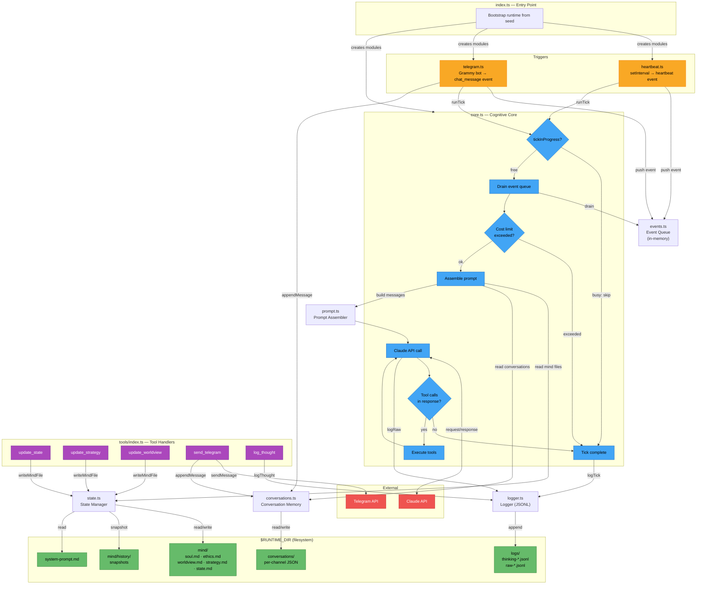

# AGI Probe — Architecture v0: The Closed Loop

## Problem

LLMs are reactive — they respond to prompts but never initiate. For an autonomous agent to have agency, it needs a **closed perception-action loop** where impulses are generated internally, not by a human typing a message.

## System Overview

```
┌─────────────────────────────────────┐
│            PERCEPTION               │
│  camera frame + audio + sensors     │
└──────────────┬──────────────────────┘
               ▼
┌─────────────────────────────────────┐
│         CHANGE DETECTION            │
│  "did anything interesting happen?" │
│  (runs locally, cheap, fast)        │
└──────────────┬──────────────────────┘
               ▼
┌─────────────────────────────────────┐
│           THE MIND (LLM)            │
│  current perception + memory +      │
│  previous state → decision          │
└──────────────┬──────────────────────┘
               ▼
┌─────────────────────────────────────┐
│             ACTION                  │
│  move camera / ask question / wait  │
└──────────────┬──────────────────────┘
               ▼
┌─────────────────────────────────────┐
│             MEMORY                  │
│  update state, interest map,        │
│  observation log                    │
└──────────────┬──────────────────────┘
               └──────► back to PERCEPTION
```

## Layers

### 1. Perception (edge device)

Continuous local capture of the environment.

- **Camera**: USB camera on Raspberry Pi, capturing frames at ~1 fps
- **Microphone**: USB mic, capturing ambient audio
- All processing local — no cloud calls at this stage

### 2. Change Detection (local, lightweight)

The impulse generator. Decides **when to wake up the mind**. The mind is expensive (cloud API call) — it should only fire when there's a reason.

| Trigger | Logic | Example |
|---|---|---|
| Visual change | OpenCV frame diff exceeds threshold | Someone walked into the room |
| Audio event | Audio level spike or VAD | A door closed, someone spoke |
| Chat message | Human sends a message | Direct input into consciousness |
| Idle timer | Nothing happened for N minutes | Boredom — time to look around |
| Heartbeat | Periodic tick regardless of change | Baseline awareness, prevents sleeping forever |

Key insight: **what counts as "interesting" can evolve.** Initially these are simple thresholds. Over time, the mind's memory can feed back to adjust what triggers attention (e.g., "I've seen the door open 50 times — stop waking me for that, unless it's at night").

### 3. The Mind (LLM)

The cognitive core. Called via cloud API when a trigger fires.

**Input (context window):**
- Current camera frame (vision)
- Recent audio transcript (if any, via cloud STT)
- Trigger reason: what caused this wake-up
- Short-term memory: last N observations and decisions
- Long-term memory: interest map, object catalog, accumulated patterns
- System prompt: identity, boundaries, current goals

**Output (structured JSON):**
```json
{
  "action": "look",
  "target": {"pan": 45, "tilt": -10},
  "reason": "movement detected near the door, checking if someone entered",
  "question": null,
  "internal_note": "third time movement near the door today — establishing a pattern",
  "memory_update": {
    "add": "door area shows frequent activity in the afternoon",
    "interest_adjustment": {"door_area": +0.1}
  }
}
```

Possible actions:
- `look` — move camera to a target position
- `scan` — sweep an area (look around)
- `ask` — queue a question for the human (via Telegram)
- `wait` — do nothing, keep watching
- `log` — record an observation without acting

### 4. Action (firmware)

Executes physical commands from the mind's decisions.

- Pan-tilt servo control via serial (Arduino/ESP32)
- Command protocol: simple serial messages (`PAN:45 TILT:-10`)
- Feedback: confirm position reached, report if blocked or out of range

### 5. Memory (persistent store)

Provides continuity between loop iterations. Without this, every tick is a blank slate.

**Short-term memory:**
- Ring buffer of last N observations (frame summaries, decisions, timestamps)
- Current attention target and reason
- Pending questions for the human

**Long-term memory:**
- **Interest map**: spatial locations weighted by how often and why the AI looked there
- **Object catalog**: things identified in the environment, with notes
- **Pattern log**: recurring events (e.g., "door opens at ~9am", "lights change at sunset")
- **Interaction history**: questions asked to human and answers received

Storage: SQLite on the Raspberry Pi.

## The Two Clocks

| Clock | Speed | Where | Cost | Purpose |
|---|---|---|---|---|
| Fast clock | ~1 Hz | Local (Pi) | Free | Perception + change detection |
| Slow clock | Event-driven | Cloud (API) | $ per call | Cognition + decision-making |

During high activity, the slow clock may fire every few seconds. During stillness, once every few minutes. The fast clock runs always.

This separation makes the system affordable — expensive LLM calls happen only when there's something to think about.

## Data Flow (one tick)

```
1. Fast clock captures frame #4827
2. OpenCV compares to frame #4826 → diff = 12% (above threshold)
3. Change detector fires trigger: {type: "visual_change", magnitude: 0.12, region: "left"}
4. Orchestrator builds context:
   - current frame
   - trigger info
   - last 5 observations from memory
   - interest map
5. Claude API call → returns: {action: "look", target: {pan: -30, tilt: 0}, reason: "..."}
6. Serial command sent to ESP32 → servos move
7. Memory updated: new observation logged, interest map adjusted
8. Back to step 1
```

## Minimum Viable Stack

| Layer | Implementation |
|---|---|
| Perception | Raspberry Pi 4/5 + USB camera + USB mic |
| Change detection | Python: OpenCV frame diff, audio level threshold, idle timer |
| Mind | Claude API (vision model, structured output) |
| Action | Serial → Arduino/ESP32 → pan-tilt servo bracket |
| Memory | SQLite on the Pi |
| Glue | Python orchestrator running the main loop |

## V0 Code Architecture

The v0 software implementation is a TypeScript-only embryo — no hardware, no sensors. The diagram below shows how the modules interact at runtime.



### Module Dependency Summary

| Module | Depends on | Depended on by |
|---|---|---|
| `config.ts` | — | All modules |
| `events.ts` | — | heartbeat, telegram, core, prompt |
| `state.ts` | config | core, prompt, tools |
| `logger.ts` | config | core, tools |
| `conversations.ts` | config, events | telegram, core, prompt, tools |
| `prompt.ts` | state, events, conversations | core |
| `tools/index.ts` | state, logger, conversations, grammy | core |
| `core.ts` | config, state, logger, events, conversations, prompt, tools | heartbeat, telegram, index |
| `heartbeat.ts` | config, events, core | index |
| `telegram.ts` | config, events, conversations, core | index |
| `index.ts` | all modules | — |

### Key Patterns

- **Tick mutex**: Only one tick runs at a time. If a trigger fires while a tick is active, events stay queued for the next tick.
- **Agentic loop**: Claude can call tools, get results, and call more tools — up to `MAX_TOOL_ITERATIONS` per tick.
- **Cost gate**: Checked before every API call. Auto-shutdown with alert if limit exceeded.
- **Late binding**: Telegram adapter receives core reference via `setCore()` to resolve the circular dependency (core needs bot for tools, telegram needs core to trigger ticks).
- **Snapshot-on-write**: Every mind file write copies the previous version to `mind/history/` before overwriting.

## Resolved Design Decisions

- **Latency**: 1-3 second API round-trip is acceptable for v0
- **Cost control**: budget cap + rate limiter (limits TBD)
- **Audio processing**: cloud STT via Deepgram — fast, affordable, avoids taxing the Pi
- **Night mode**: system stays on but enters low-activity sleep-like state during night hours
- **Human communication channel**: Telegram
